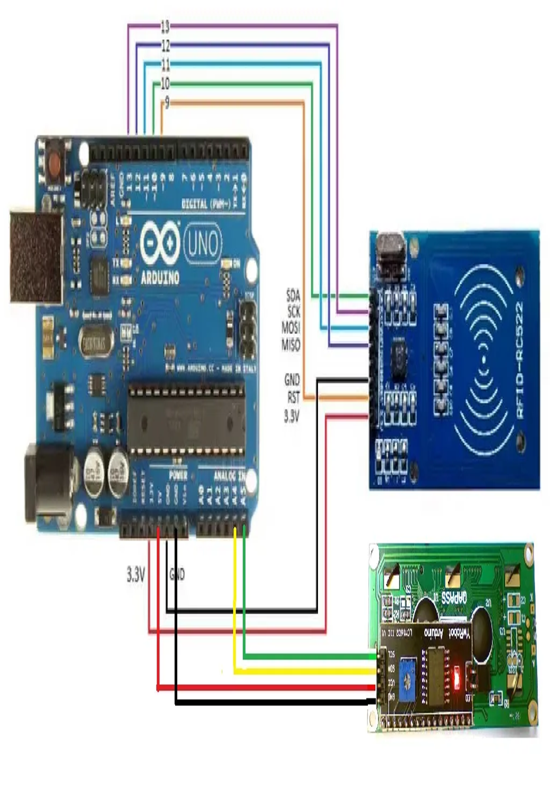
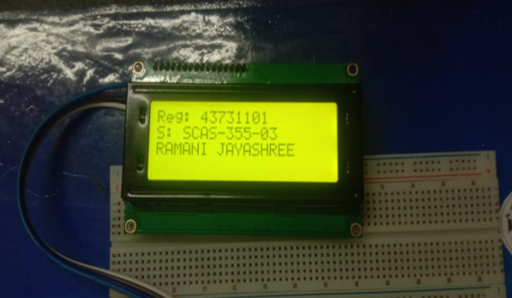

# RFID Smart Attendance Monitoring System

An automated attendance management system built with **Arduino Uno** and **RFID technology** that eliminates manual attendance marking, reduces errors, and prevents proxy attendance.

## 📌 Overview
This project automates attendance tracking using RFID technology and Arduino Uno. It replaces manual roll calls and paper registers with an efficient, error-free digital system.

## ✨ Features
- 🔑 RFID tag scanning for unique user identification
- 📟 LCD display showing real-time attendance status  
- ⏱️ RTC module for accurate timestamp logging
- 💡 LED indicator for successful attendance confirmation
- 📊 Database integration for record storage
- 🔒 Prevents buddy punching/fraudulent attendance

## 🛠️ Hardware Required
| Component | Quantity |
|-----------|----------|
| Arduino Uno | 1 |
| MFRC522 RFID Reader | 1 |
| RFID Tags/Cards | Multiple |
| 16x2 LCD Display | 1 |
| DS3231 RTC Module | 1 |
| LED (Green) | 1 |
| Buzzer (Optional) | 1 |
| Breadboard & Jumper Wires | As needed |
| 9V/12V Power Supply | 1 |

## 💻 Software Required
- Arduino IDE
- MySQL / SQLite
- Required Libraries:
  - MFRC522.h
  - SPI.h
  - Wire.h
  - LiquidCrystal_I2C.h
  - RTClib.h

## 🔌 Circuit Connections
RFID MFRC522 -> Arduino Uno
SDA (SS) -> Pin 10
SCK -> Pin 13
MOSI -> Pin 11
MISO -> Pin 12
IRQ -> Not Connected
GND -> GND
RST -> Pin 9
3.3V -> 3.3V

LCD I2C -> Arduino Uno
VCC -> 5V
GND -> GND
SDA -> A4
SCL -> A5
LED -> Pin 7

## 📷 Circuit Diagram


## 📷 Sample Output


## 🚀 How It Works
1. User scans RFID tag near reader
2. System reads unique UID from tag
3. Verifies against registered database
4. Marks attendance with timestamp if valid
5. Shows confirmation on LCD and LED
6. Stores record in database

## 📋 Sample Code
```cpp
#include <SPI.h>
#include <MFRC522.h>

#define SS_PIN 10
#define RST_PIN 9

MFRC522 rfid(SS_PIN, RST_PIN);
String registeredUID[] = {"A1B2C3D4", "E5F6G7H8"};

void setup() {
  Serial.begin(9600);
  SPI.begin();
  rfid.PCD_Init();
  Serial.println("Scan your card");
}

void loop() {
  if (rfid.PICC_IsNewCardPresent()) {
    if (rfid.PICC_ReadCardSerial()) {
      String uidString = "";
      for (byte i = 0; i < rfid.uid.size; i++) {
        uidString += String(rfid.uid.uidByte[i], HEX);
      }
      Serial.print("Card UID: ");
      Serial.println(uidString);
      rfid.PICC_HaltA();
    }
  }
}

## Sample Output
Card UID: A1B2C3D4
Attendance Recorded
Access Granted

Card UID: X9Y8Z7W6
Access Denied
